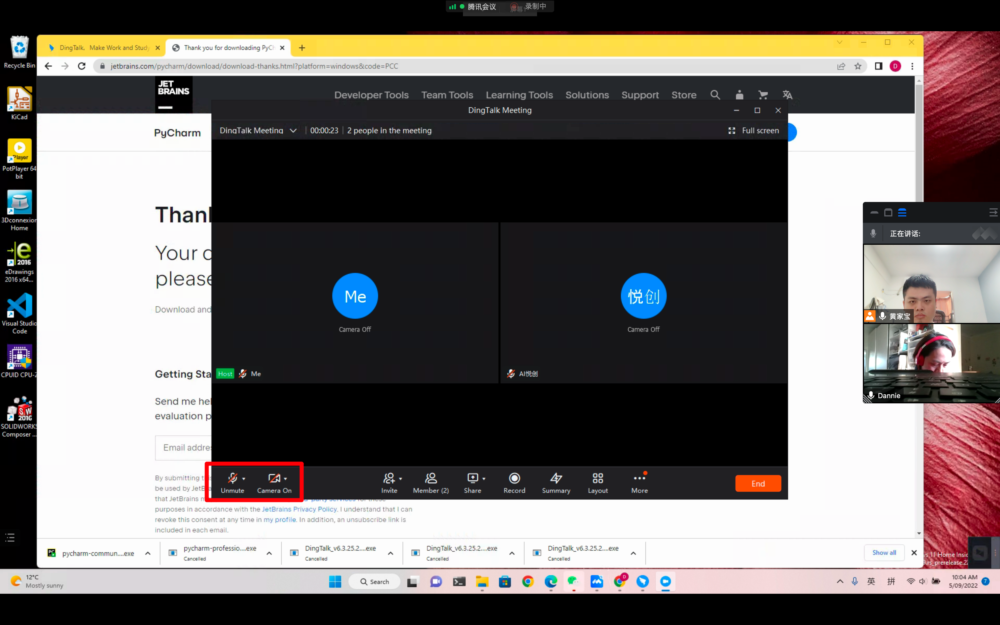
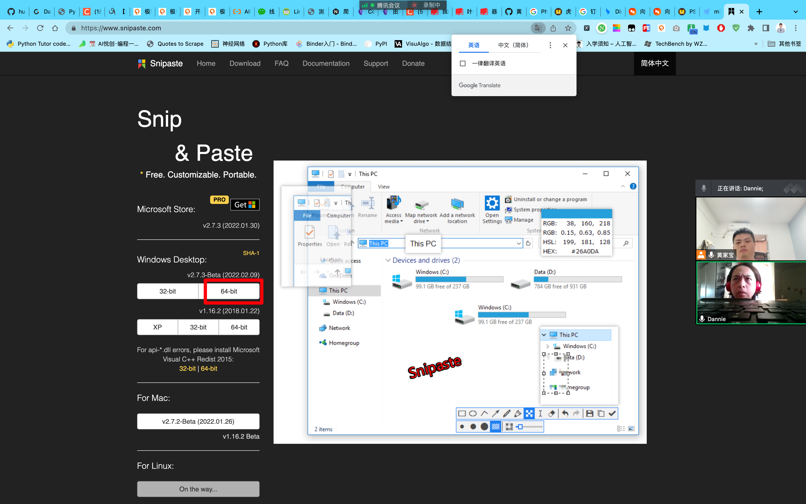

[[toc]]

## 01-Python 环境搭建「Dannie」

## 1. Python 环境检验

成功！！！

## 2. 钉钉直播教学

---

## 3. 安装程序「all」

- [x] Pycharm
- [x] 钉钉
- [x] Python
- [x] Snipast：[https://www.snipaste.com/](https://www.snipaste.com/)

- [x] ConEmu：[https://www.fosshub.com/ConEmu.html](https://www.fosshub.com/ConEmu.html)

- [ ] SublimeText：[https://www.sublimetext.com/download](https://www.sublimetext.com/download)

## 4. YouTube 录课+B站

