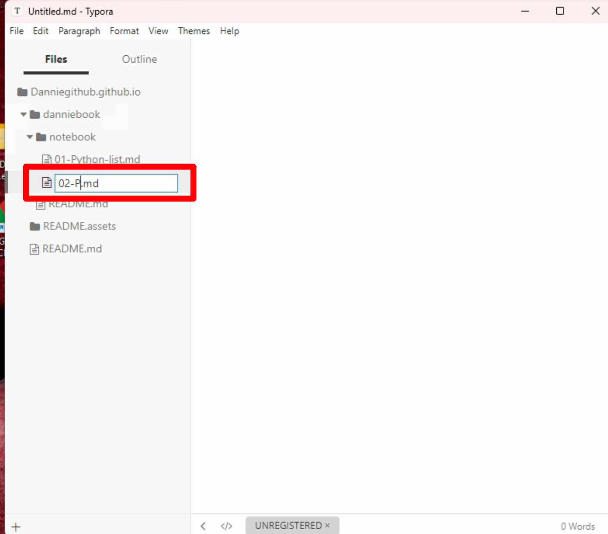
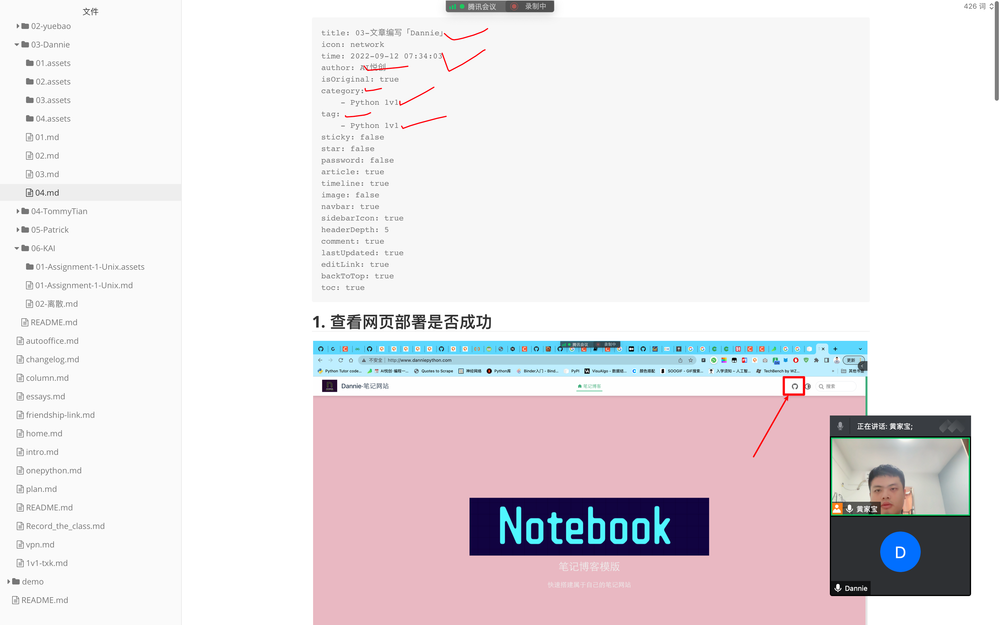

[[toc]]

## 04-文章编写「Dannie」

## 1. 查看网页部署是否成功


查看最新的，只要是绿色，那就是部署成功。如果没有显示那就是缓存，过段时间就会 update。

## 2. 设置 git 密钥 SSH

## 3. 写文章与部署




先三个减号回车即可。



文章编写头部内容：

```python
title: 03-文章编写「Dannie」
icon: network
time: 2022-09-12 07:34:03
author: AI悦创
isOriginal: true
category: 
    - Python 1v1
tag:
    - Python 1v1
sticky: false
star: false
password: false
article: true
timeline: true
image: false
navbar: true
sidebarIcon: true
headerDepth: 5
comment: true
lastUpdated: true
editLink: true
backToTop: true
toc: true
```

## 文章日期生成

- [https://bornforthis.cn/python/index.html#/](https://bornforthis.cn/python/index.html#/)

