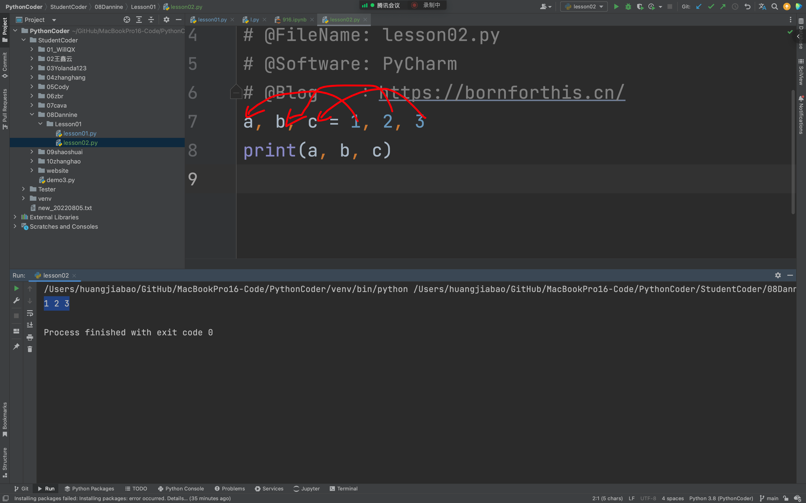
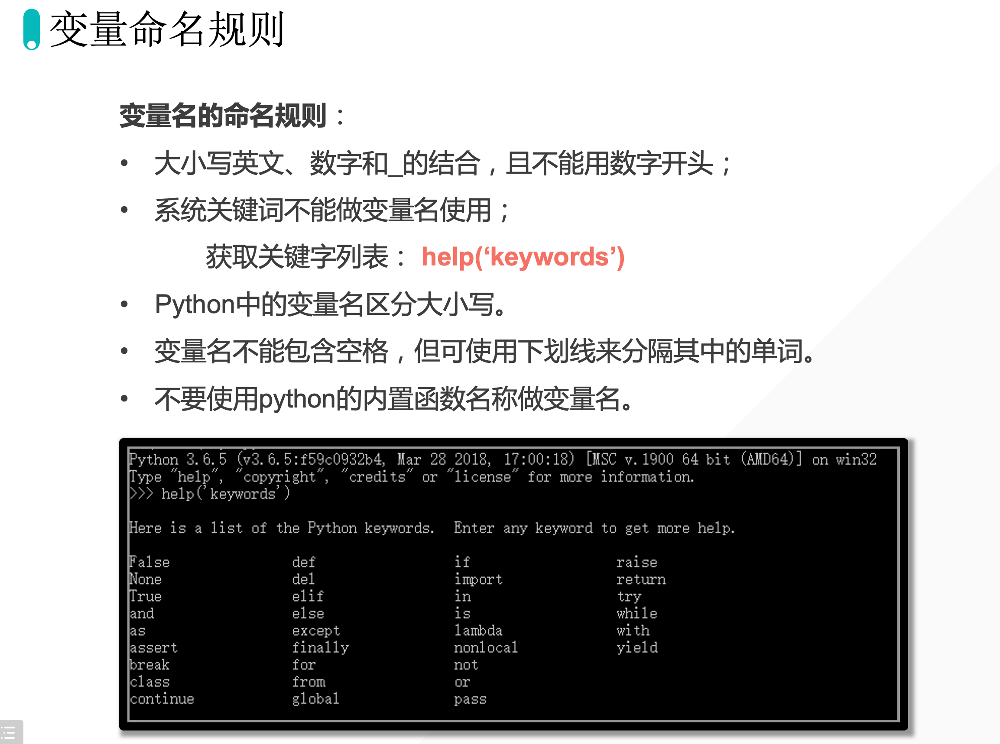

[[toc]]

## 07-变量「下」「Dannie」

## 1. 同时给多个变量赋予不同的值

```python
a, b, c = 1, 2, 3
print(a, b, c)
```

输出：

```python
1 2 3
```



## 2. 代码练习1：交换果汁

**题目链接：**

[https://bornforthis.cn/column/py/basequestion/special_variabl.html#_1-%E4%BA%A4%E6%8D%A2%E6%9E%9C%E6%B1%81](https://bornforthis.cn/column/py/basequestion/special_variabl.html#_1-%E4%BA%A4%E6%8D%A2%E6%9E%9C%E6%B1%81)


### 2.1 Dannie 编写的代码

```python
Austin = 'Coke'
Jaden = 'Juice'
Austin, Jaden= 'Juice', 'Coke'
print('Austin', Austin)
print('Jaden', Jaden)
```

**评价：这个地方你是直接拿 value 来进行赋值，算不上是交换果汁。**

自行修正的代码：

```python
Austin = 'Coke'
Jaden = 'Juice'
Austin, Jaden = Jaden, Austin
print('Austin', Austin)
print('Jaden', Jaden)
```

### 2.2 方法二：引入第三个变量


```python
Austin='Coke'
Jaden='Juice'
Dannie= Austin
Austin= Jaden
Jaden= Dannie
print('Austin', Austin)
print('Jaden', Jaden)
```

**两种方法思路：**

方法一： 联想现实生活，现实生活中你会如何解决？

> 现实生活中，我想你会引入一个空杯子来操作，那你会如何操作？思考后再思考代码中如何实现？

方法二： Python 多个变量赋予不同值。
a, b, c = 1, 2, 3

## 3. 代码练习2：变量的创建并输出

**题目链接：**

[https://bornforthis.cn/column/py/basequestion/special_variabl.html#_2-%E5%88%9B%E5%BB%BA%E5%8F%98%E9%87%8F%E5%B9%B6%E8%BE%93%E5%87%BA](https://bornforthis.cn/column/py/basequestion/special_variabl.html#_2-%E5%88%9B%E5%BB%BA%E5%8F%98%E9%87%8F%E5%B9%B6%E8%BE%93%E5%87%BA)

### 3.1 Dannie 编写的代码

```python
a = 'Austin'
b = 'Jaden'
c = 'Alex'
d = 'Cava'
print(a, end='$')
print(b, end='$')
print(c, end='$')
print(d, end='%')
```

### 3.2 优化后的代码

```python
a = 'Austin'
b = 'Jaden'
c = 'Alex'
d = 'Cava'
print(a, b, c, d, sep="$", end="%")
```

## 4. 变量的命名规则

### 4.1 变量区分大小写

```python
A = "Lilei"
a = "hanmeimei"
print(a)
print(A)
```

输出：

```python
hanmiemi
Lilei
```

::: tip 解析

如果，不区分大小写的话，那最后的结果应该是，都是输出：hanmeimei。由上面的结果可知 Python 的变量是区分大小写的。

:::

### 4.2 系统关键词不能做变量

用如下命令获取系统关键词：

```python
help("keywords")
```

```python
Here is a list of the Python keywords.  Enter any keyword to get more help.

False               break               for                 not
None                class               from                or
True                continue            global              pass
__peg_parser__      def                 if                  raise
and                 del                 import              return
as                  elif                in                  try
assert              else                is                  while
async               except              lambda              with
await               finally             nonlocal            yield
```

系统/Python 不知道如何区分我们的关键词还是变量。

如果说，我们非要”用“关键词来做变量的话，就可以使用 **区分大小写** 的原理。

```python
AS = "aa"
```

**变量名的命名规则**：

- 大小写英文、数字和 `_` 的结合，且不能用数字开头；
- 系统关键词不能做变量名使用；

- 获取关键字列表：`help(”keywords’)` 

- Python 中的变量名区分大小写。

- 变量名不能包含空格，但可使用下划线来分隔其中的单词。

- **不要使用 python 的内置函数名称做变量名。**

```python
print = "aiyc"
print(print)
```

```python
Traceback (most recent call last):
  File "/Users/huangjiabao/GitHub/MacBookPro16-Code/PythonCoder/StudentCoder/08Dannine/Lesson01/lesson02.py", line 8, in <module>
    print(print)
TypeError: 'str' object is not callable
```



