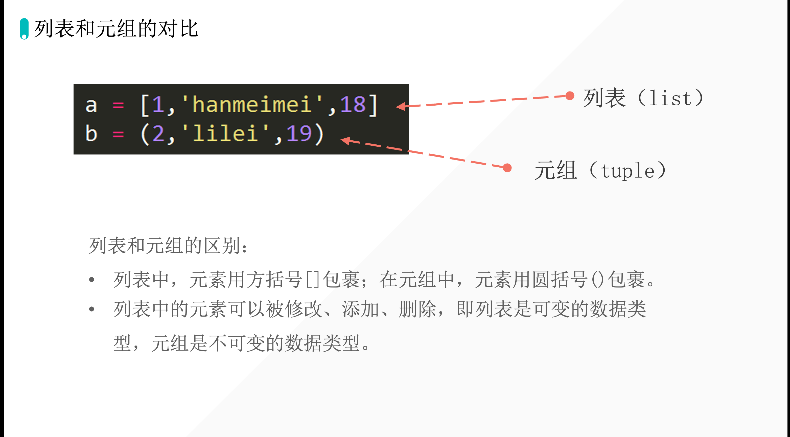
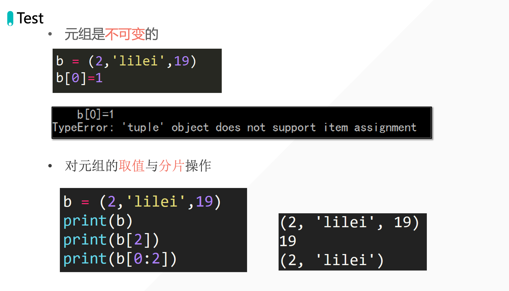

[[toc]]

## 12-元组「Dannie」

## 列表和元组的对比



## 元组数据提取

## Test



## 特殊

元组只有一个元素的时：

```python
t = (1)
print(type(t))
```

输出：

```python
<class 'int'>
```

解决方法：

```python
t = (1,)
print(type(t))
```

输出：

```python
<class 'tuple'>
```

## 对元组进行排序

```python
t = (1, 4, 2, 6, 5, 3, 8, 7, 9, 10)
```

```python
tup=(1515,4545,4545,454,7874877,88485,44564)

tup_new=tuple(sorted(tup))

print(tup_new)
```

输出：`(454, 1515, 4545, 4545, 44564, 88485, 7874877)`

> 元组若进行排序的话， 一定要强制转化元组。 具体意思就是 `tup_new=tuple(sorted(tup))`  ,   这里一定是要 tuple 

