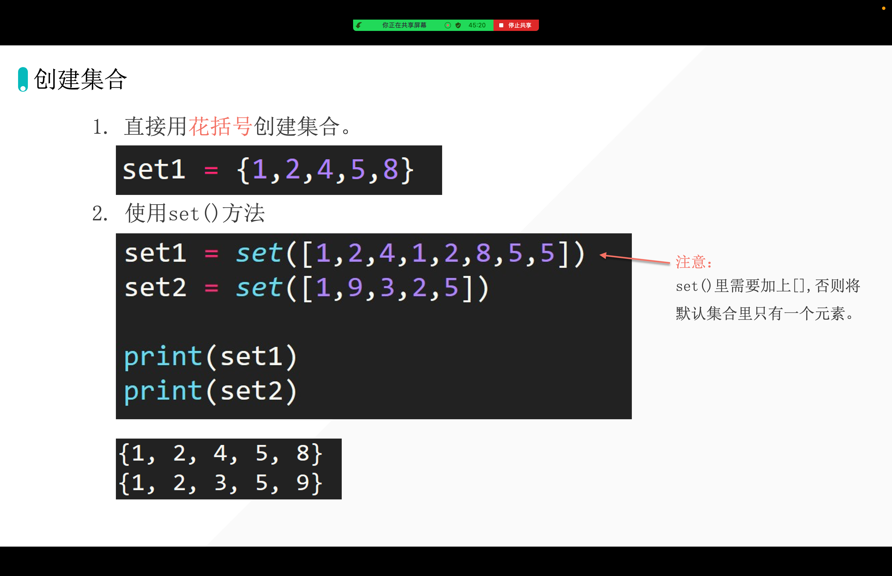
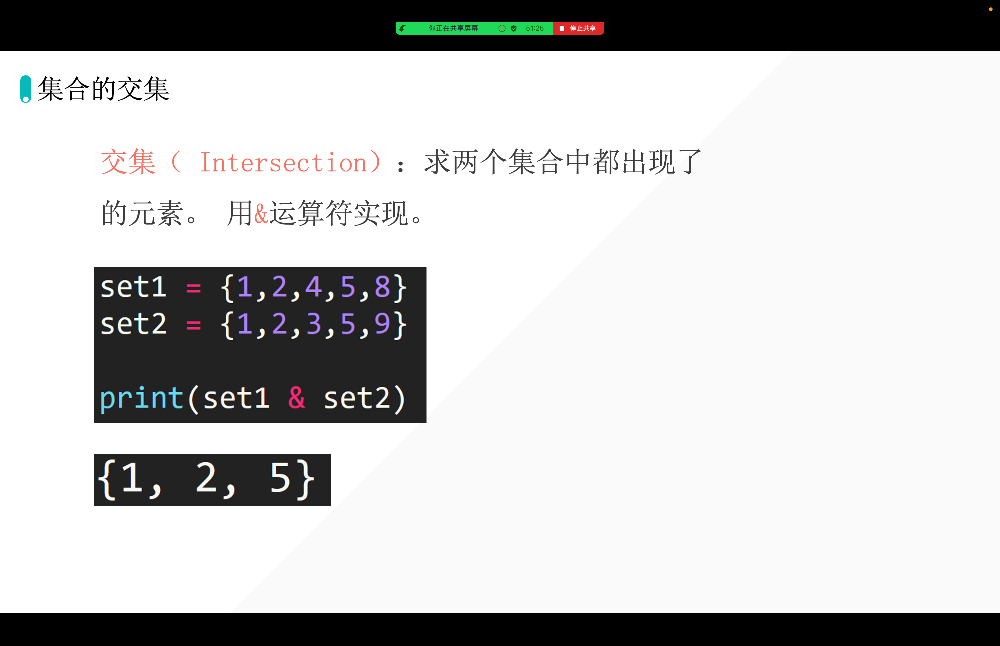
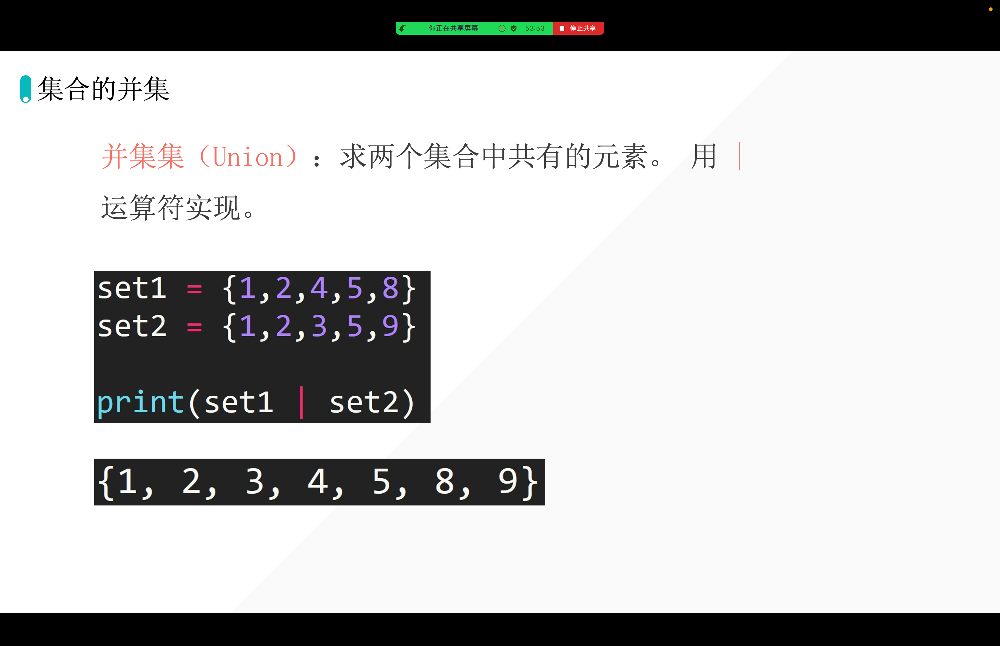
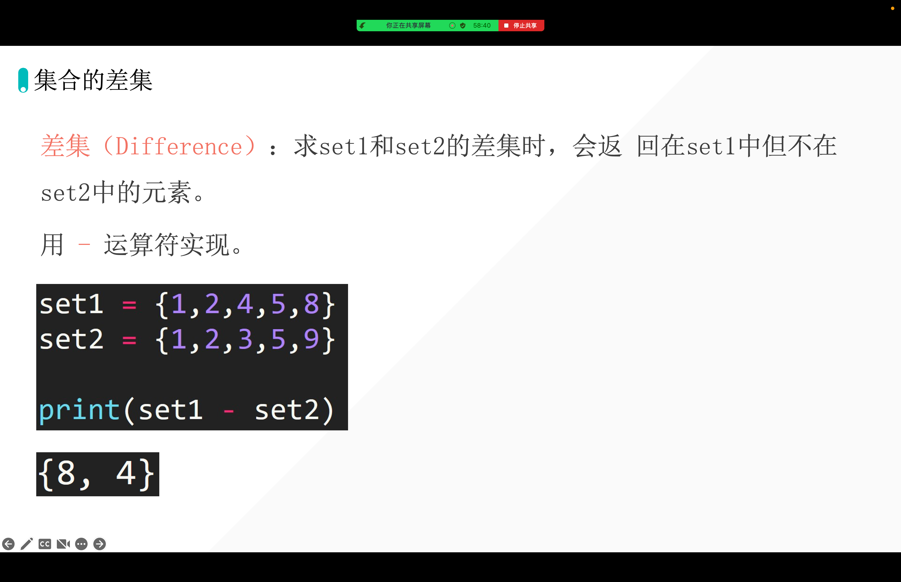
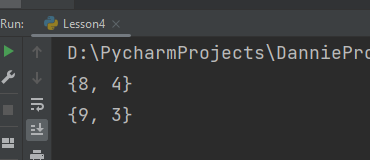
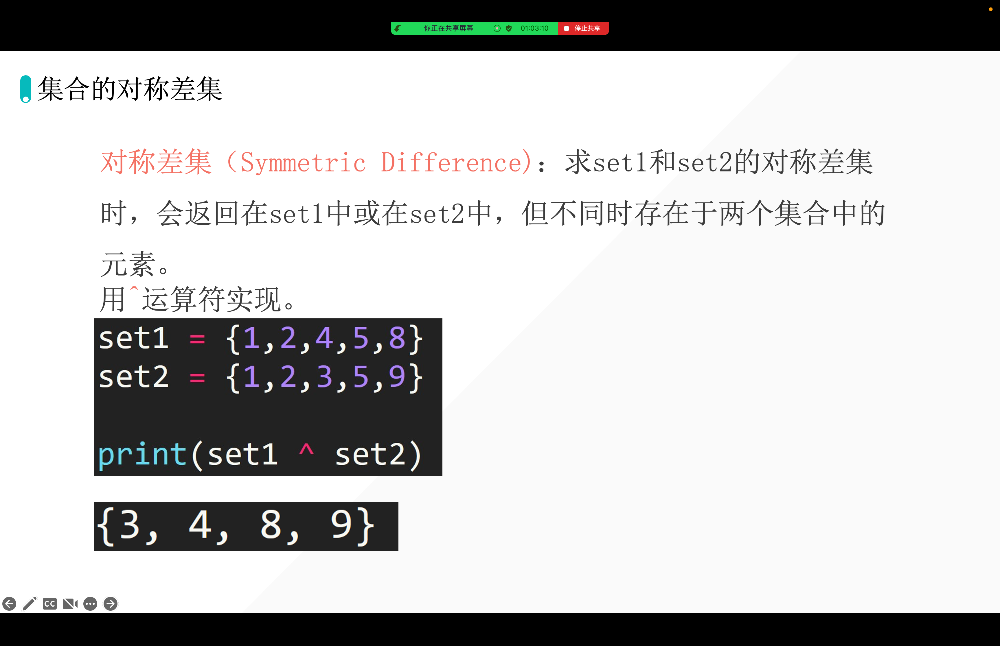
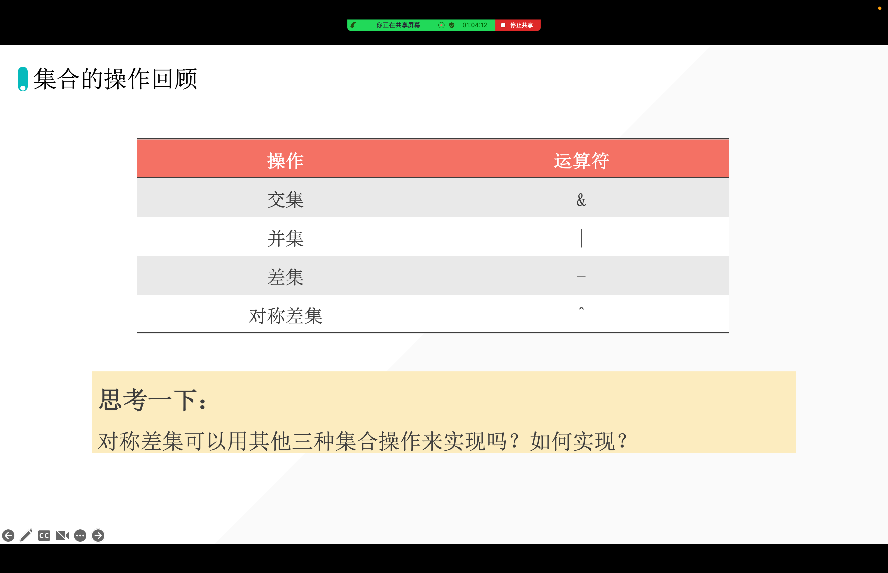
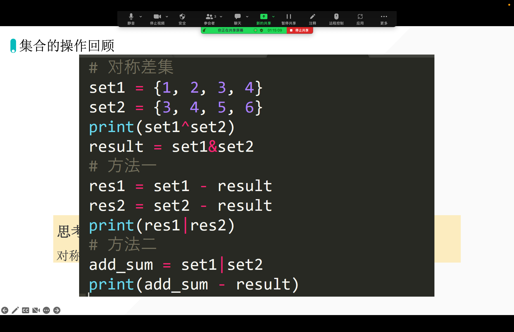

[[toc]]

## 集合的创建「create set」

```python
s = {1, 2, 3, 4}
print(s)
print(type(s))
```



## 集合的交集「Intersection」



## 集合的并集「Union」



## 集合的差集「Difference」



```python
set1 = {1, 2, 4, 5, 8}
set2 = {1, 2, 3, 5, 9}

print(set1 - set2)
print(set2 - set1)
```

输出：



```python
print(set1 - set2)### 就是在 set1 里面把也出现在 set2 里面的间谍除掉，再输出剩下的。
print(set2 - set1)### 就是在 set2 里面把也出现在 set1 里面的间谍除掉，再输出剩下的。
```

## 集合的对称差集「Symmetric Difference」







