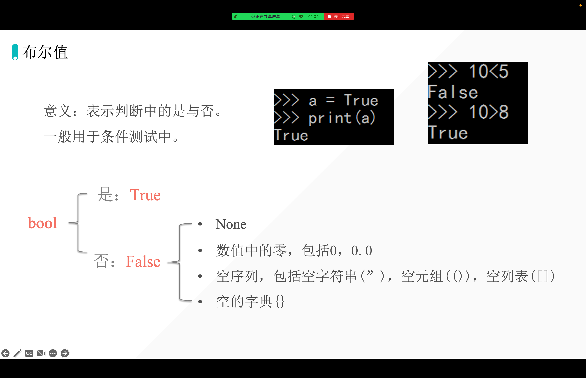
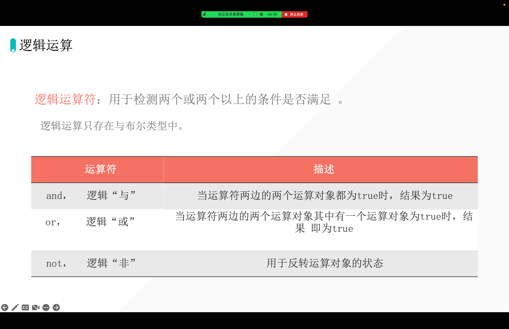
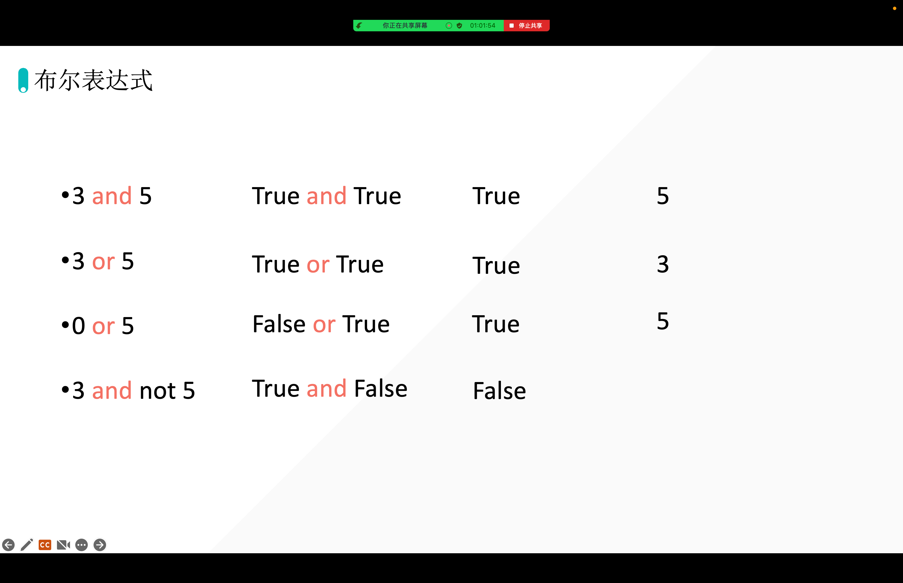
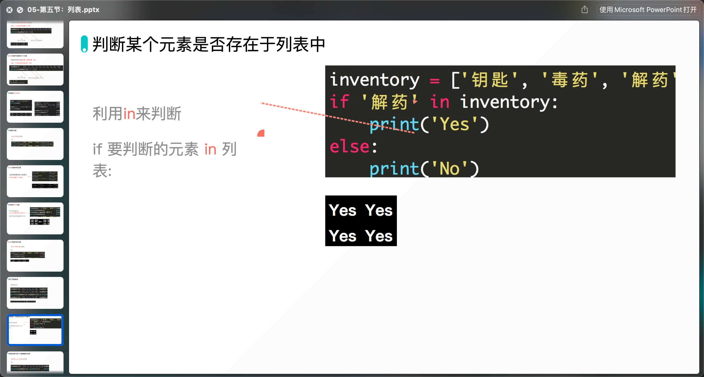
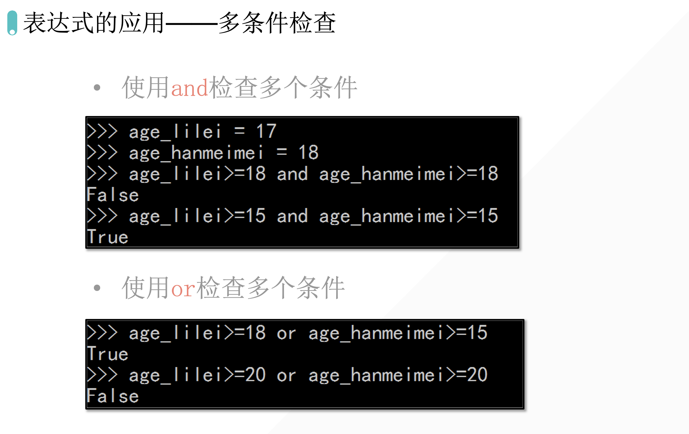

[[toc]]

## 1. 列表和元组基础

首先，我们需要弄清楚最基本的概念，什么是列表和元组呢？

实际上，列表和元组，都是**一个可以放置任意数据类型的有序集合。**

【共同】列表和元组，都是一个可以放置任意数据类型的有序集合。在Python中对列表和元组并没有集合的数据类型必须一致的要求。 

【区别】列表是动态的，长度大小不固定，可以随意地增加、删减或者改变元素（mutable）。 而元组是静态的，长度大小固定，无法增加删减或者改变（immutable）。

内部的排列是有序的，比如遍历一遍并打印，其顺序应该和插入元素的顺序一样

[https://www.yuque.com/aiyuechuang/qogtbo/bu5m4e](https://www.yuque.com/aiyuechuang/qogtbo/bu5m4e)

## 布尔值

## 判断数据在不在列表「序列」

## 多条件检查

## 

