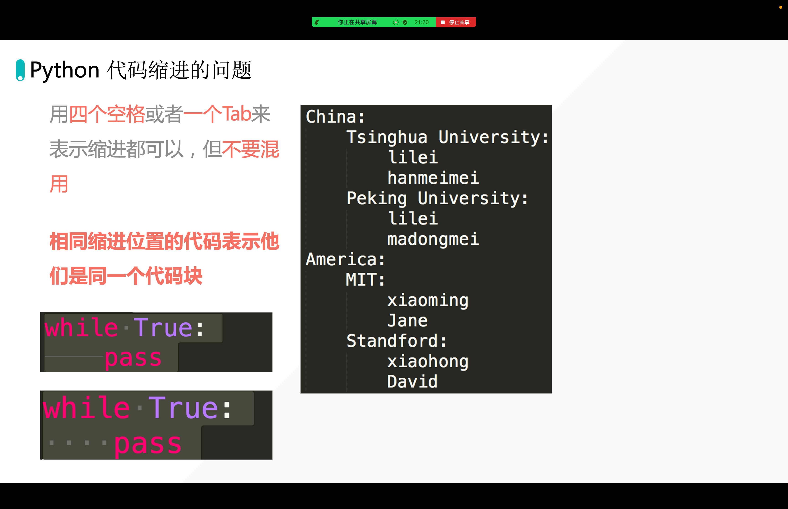
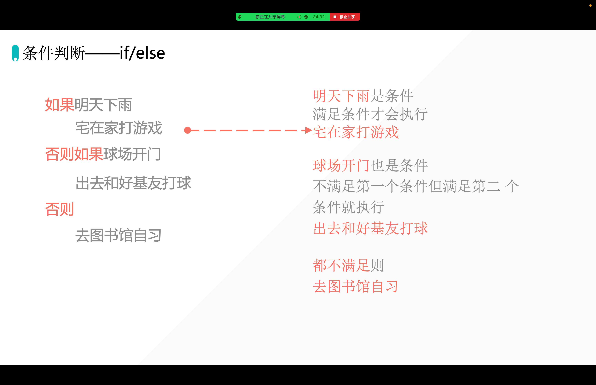
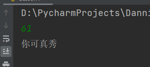

[[toc]]





```python
rain = True
球场开门 = True
if rain == True:
    print("打游戏")
elif 球场开门 == True:
    print("打球去")
else:
    print("自习")
```


```python
a = 5
if type(a / 2) == int:
    print("偶数")
else:
    print("奇数")
```

输出：

```python
奇数
```

```python
a = 5
if (a % 2) == 0:
    print("偶数")
else:
    print("奇数")
```

## 1025：【例3.1】购买笔记本(粤版)

### 【题目描述】

某商店笔记本有促销活动，规定购买6本以上（含6本）10本以下（含10本）打九折，购买11本以上（含11本）打八折。给定笔记本单价和购买数量，请问购买总费用。

### 【输入】

第一行一个整数s，表示购买s本笔记本。

第二行一个实数p，表示笔记本单价是p。

### 【输出】

输出一行，表示总费用。保留小数点后一位。

### 【输入样例】

```
100 3.2
```

### 【输出样例】

```
256.0
```

### 答案

```python
s = int(input())  # 笔记本数量
p = float(input())
if s < 6:  # 不打折
    j = 1.0
elif s <= 10:  # 打九折
    j = 0.9
else:  # 打八折
    j = 0.8
t = s * p * j  # 总费用
print("%.1f" % t)  # 保留到小数点后一位
```

## 题目2

```python
# 获取用户输入判断：
# 小于 10，输出：数字小于10
# 大于10小于60输出：数字在10与60之间
# 大于60：输出：你可真秀
s = int(input())

if s < =10:
    print(s)

elif s <= 60:
    print(s)

else:
    print('你可真秀')
```



## 进阶题目

### Q1：区分奇数、偶数

```python
# Q1：区分奇数、偶数
lst = [1, 2, 6, 3, 33, 99, 44, 22, 11, 16, 88]
even_list = []  # 存偶数
unerven_list = [] # 存奇数
# [0, 1, 2, 3, 4, 5, 6, 7, 8, 9, 10, 11, 12, 13, 14, 15, 16, 17, 18, 19]
# print(lst)
for i in lst:
    # print(i)
    # ......补充判断代码
```

答案：

```python
# Q1：区分奇数、偶数
lst = [1, 2, 6, 3, 33, 99, 44, 22, 11, 16, 88]
even_list = []  # 存偶数
unerven_list = [] # 存奇数
# [0, 1, 2, 3, 4, 5, 6, 7, 8, 9, 10, 11, 12, 13, 14, 15, 16, 17, 18, 19]
# print(lst)
for i in lst:
    # print(i)
    # ......补充判断代码
    if i % 2 == 0:
        even_list.append(i)
    else:
        unerven_list.append(i)

print(even_list)
print(unerven_list)
```


